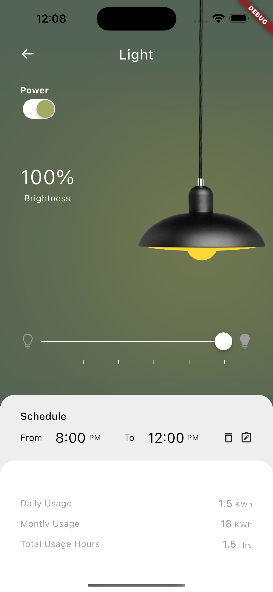

# Flutter Lightning App

This repository contains a Flutter UI that allows you to control the intensity of lighting for a lamp. With this app, you can effortlessly adjust the brightness levels of your lamp, creating the perfect ambiance for any setting.

## Features
- Intuitive and user-friendly interface for easy lamp control
- Smooth and responsive performance for a delightful user experience
- Customizable settings to personalize your lighting preferences

## Getting Started

To get started with the Flutter Lamp Control App, follow these steps:

1. Clone the repository: git clone https://github.com/alvaroarmijos/lightning_app
2. Navigate to the project directory: `cd lightning_app`
3. Install dependencies: `flutter pub get`
5. Build and run the app: `flutter run`

Note: Make sure you have Flutter and Dart installed on your machine before proceeding.

## Contributing

Contributions to the Flutter Lightning App are welcome! If you encounter any issues or have suggestions for improvements, please feel free to submit a pull request. Let's work together to make this app even better.

## License
This project is licensed under the MIT License. Feel free to use, modify, and distribute the code for personal and commercial purposes.

## Acknowledgements
We would like to thank the Flutter community for their continuous support and the contributors who have helped shape this application.

## Contact
For any inquiries or questions, please contact us.

Happy lightning controlling! 💡✨

